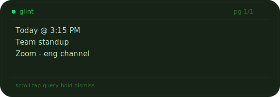
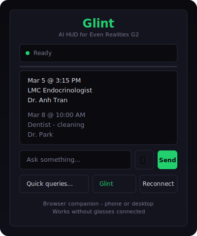

# Glint — AI HUD for Even Realities G2

An AI assistant that streams answers directly to the G2's micro-LED display. Ask questions by voice, text, or gesture — get concise answers on your glasses in real time.



---

## How It Works

```
G2 Glasses ──BLE──► Phone ──WSS──► Glint Relay ──WS──► AI Backend
   HUD display        App           Auth + routing      Agent execution
   Mic + gestures     Bridge        STT, images         Tools, memory
```

**Glint Relay** is a lightweight server that bridges the G2 to a multi-agent AI backend. It handles authentication, speech-to-text, image conversion, notification routing, and streams agent responses back to the HUD — paginated and formatted for the 46×5 character display.

A **browser companion** provides the same experience on your phone when glasses aren't connected — text input, voice, quick presets, agent switching, and streaming responses.



---

## Features

**Core**
- Streaming responses with auto-pagination on HUD and auto-scroll in browser
- Voice input (server-side Whisper + Web Speech API fallback)
- Text input with send-on-enter in browser companion
- 8 configurable quick presets (calendar, messages, weather, commute, etc.)
- Multi-agent switching — temple tap on glasses, dropdown in browser

**HUD Display**
- 3-zone layout: status bar, content area, context-sensitive hint bar
- Markdown stripping and word wrapping for HUD readability
- Agent image blocks rendered as 4-bit greyscale BMP with Floyd-Steinberg dithering
- Display hint injection for concise agent output

**Browser Companion**
- Thinking indicator with elapsed timer
- Connection status dot (green/yellow/red)
- Agent selector and preset dropdown
- Mic button for phone-side voice input

**Resilience**
- Response caching for offline viewing
- Message queueing during disconnection
- Ping/pong keepalive with auto-reconnect
- Stable session keys across reconnections

**Notifications**
- AI backend events forwarded as HUD overlay notifications
- Configurable event filtering with wildcard patterns
- Do-not-disturb toggle

---

## Gesture Map

| Gesture | Action |
|---|---|
| Ring click | Start/stop voice query |
| Ring scroll ↕ | Page through response / browse presets |
| Ring double-click | Dismiss / toggle DND |
| Temple tap left | Cycle agent |
| Temple tap right | Toggle TTS |

---

## Performance

With a dedicated lightweight agent on a fast model (Gemini Flash), responses arrive in under a second. Heavier agents with tool calling and memory are available when richer context is needed — switchable on the fly.

---

## Tech

- TypeScript end-to-end (app + relay + protocol)
- Fastify relay server, deployable as macOS launchd service or Docker
- Vite build with legacy polyfills (Chrome 67+, Android 8+)
- 35 tests passing across unit and integration suites
- Works over Tailscale — accessible from anywhere

---

## Status

The software is complete and tested. Currently seeking developer access to the Even Hub platform for native G2 deployment. The browser companion is fully functional today.

Interested in collaborating or have access to Even Hub app loading? Reach out.

---

Built with the [Even Hub SDK](https://www.npmjs.com/package/@evenrealities/even_hub_sdk).
